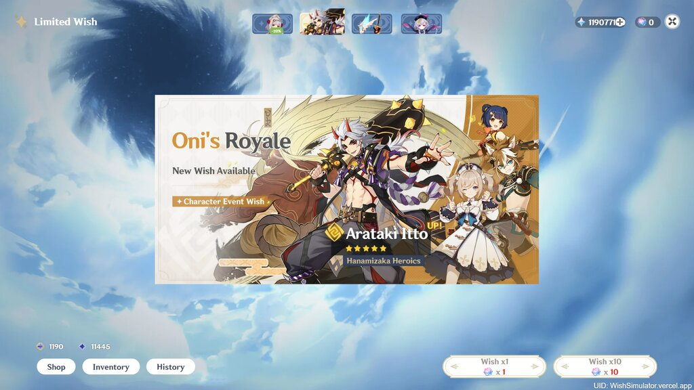

# Realistic Genshin Impact Wish Simulator

Most Realistic Genshin Impact Wish Simulator for web version. Include meteor and reveal animation. Visit the live version at [https://wishsimulator.vercel.app](https://wishsimulator.vercel.app)

## Desktop




## Mobile


---

## Developing

This app build with Svelte Kit base on Javascript programming languange.

Once you've cloned this project, install all dependencies with `npm install` (or `pnpm install` or `yarn`), and start a development server:

```bash
npm run dev

# or start the server and open the app in a new browser tab
npm run dev -- --open
```

## Building

Before creating a production version of your app, install an [adapter](https://kit.svelte.dev/docs#adapters) for your target environment. Then:

```bash
npm run build
```

## Features

1. Gacha on all banner ( Beginner, Standard, Character Event, and Weapon Banner )
2. Dual or Single Character event Banner
3. Epitomized Path System on Weapon Banner Wish
4. User can do gacha on all bannaer start from version 1.0 - latest.
5. *5 Item guaranteed at 90 roll and featured *5 item guaranteed at 180 roll
6. Probability to get \*5 is 0.6%, at pity 73 the rate starts to increase by 6% and guaranteed at 90, almost like the real game
7. Gacha milestone bonus, Starglitter and Stardust, exchangable to Aquaint or Intertwined Fate on shop
8. **Shop** Section to refill Primogem or Genesis Crystall
9. Shared Pity with previous banner, so user can continuously gacha on diferent banner without reset pity.
10. Different banner type has different **Gacha History**
11. **Inventory** to show all items ( characters and weapons ) that already owned by gacha
12. Responsive Layout and mobile friendly both landscape or portrait orientation.
13. All user data will saves to localstorage and IndexedDB.
14. Screenshot and download wish result localy.
15. Link generator if user want to share their gacha result throught internet.

---

`Note : No affiliation with mihoyo, all data used for this applications belongs to Mihoyo`
