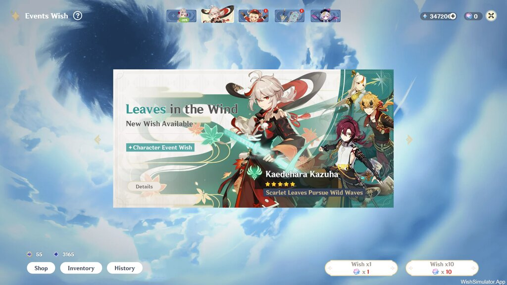
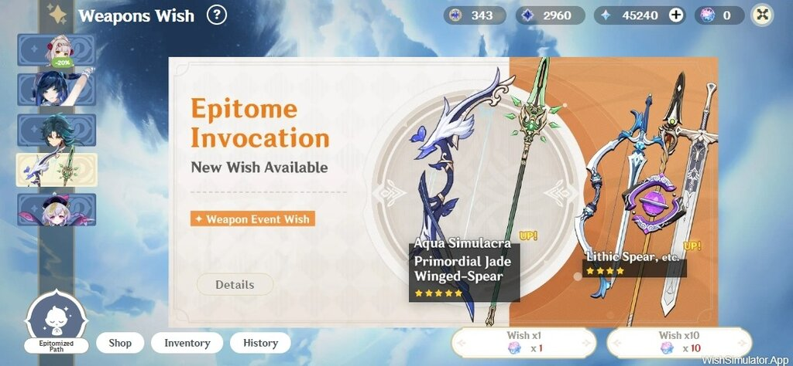
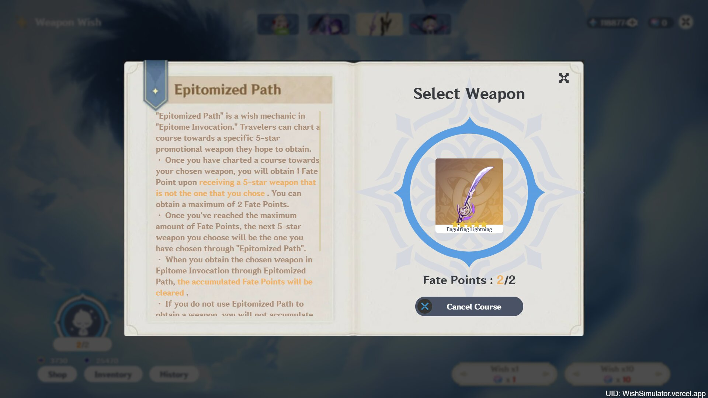
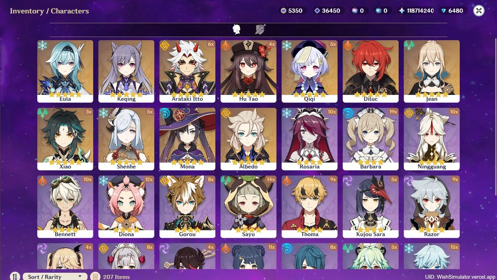
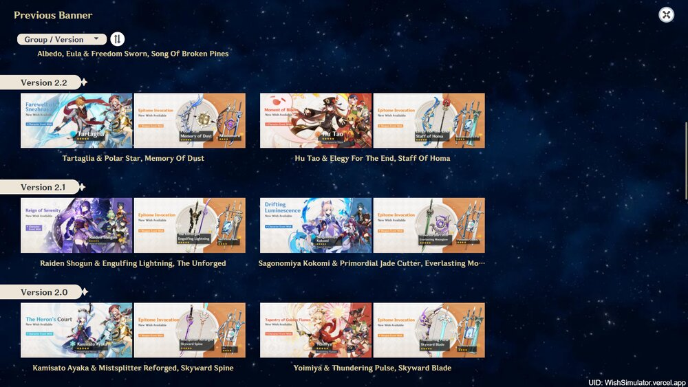

# Realistic Genshin Impact Wish Simulator

  [](https://www.codefactor.io/repository/github/aguzztn54/genshin-impact-wish-simulator)   [](https://saweria.co/mantan21)

I'm not expert, I can't write clean code, but I try to create this Genshin Impact Wish Simulator. I can claim this is the most Realistic one for web version. However, I still need your feedbacks to improve the wishing experience.

## Screenshots

#### Main Banner



#### Layout on Mobile Version



#### Epitomized Path



#### Inventory



#### Switch banner



> For more preview, please visit the live version at [https://wishsimulator.app](https://wishsimulator.app)

---

## Developing

This app build with Svelte Kit base on Javascript programming languange.

Once you've cloned this project, install all dependencies with `npm install` (or `pnpm install` or `yarn`), and start a development server:

```bash
npm run dev

# or start the server and open the app in a new browser tab
npm run dev -- --open
```

## Building

Before creating a production version of your app, install an [adapter](https://kit.svelte.dev/docs#adapters) for your target environment. Then:

```bash
npm run build
```

## Deploying

Before Deploy to online server, please setup the environment variables by renaming file `.env.example` to `.env`, please change the variables if needed.
After that, if you want to serve some assets through cdn, you can set your Github informations that you use to save your assets. The site will use free cdn service for free, if you want to use another cdn service, please do setup yourself

## Features

1. Gacha on all banner ( Beginner, Standard, Character Event, and Weapon Banner )
2. Dual or Single Character Event Banner
3. Epitomized Path System on Weapon Banner
4. User can do gacha on all banner start from version 1.0 - latest.
5. *5 Item guaranteed at 90 roll and featured *5 item guaranteed at 180 roll
6. Probability to get \*5 is 0.6%, at pity 73 the rate starts to increase by 6% and guaranteed at 90, almost like the real game
7. Gacha Milestone Bonus, Starglitter and Stardust, exchangable to Aquaint or Intertwined Fate in the shop
8. **Shop** Section to refill Primogem or Genesis Crystal
9. Shared Pity with Previous Panner, so user can continuously gacha on diferent banner without reset pity.
10. Different banner type has different **Gacha History**
11. **Inventory** to show all items ( characters and weapons ) that already owned by gacha
12. Responsive Layout and mobile friendly both landscape or portrait orientation.
13. All user data will saves to localstorage and IndexedDB.
14. Screenshot and download wish result localy.
15. Link generator when user want to share their gacha result through internet.

---

`Note : This App is not affiliated with mihoyo, all data used for this application belongs to Mihoyo`
